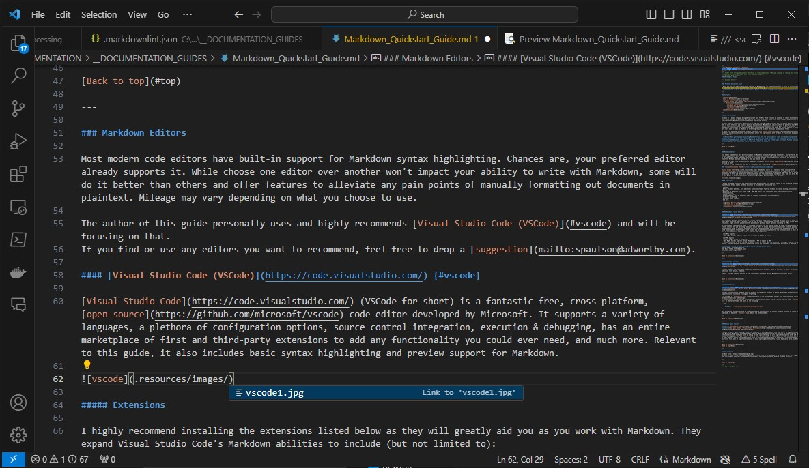

<!-- 
Note: This guide contains references to local image files. **Moving, copying, or viewing this file without its associated .resources folder will break embedded images that do not have fallback urls.** 
-->
<!-- 
Note: SharePoint's HTML preview does not correctly display this file. Certain elements are represented incorrectly or entirely missing (such as images.) 
For the best experience, view the HTML version of this file directly in your browser (download or open directly if hosted on a web server.)
-->

<!-- Enable communication between this file and Documentation_Explorer.html when loaded in an iframe. -->
<script type="text/javascript" src="../../Connector.js"></script>

<!-- Document Head Anchor -->
<!-- This enables the ability to use "back to top" links to return to the start of the document -->
<hidden id="top">

<!-- Document Start -->
---

#### Markdown Quickstart Guide

> Below you can find a basic high-level overview of Markdown and its usefulness as well as links to various resources to assist you when writing documentation files using Markdown.
> ***Note:** This is by no means a comprehensive guide. For further reading, refer to [Web Resources](#web-resources).*

> *For the best experience, download and view the HTML version directly in your browser.*

---

## Contents

- [Contents](#contents)
- [What is Markdown?](#what-is-markdown)
- [Web Resources](#web-resources)
- [Editing Markdown](#editing-markdown)
  - [Visual Studio Code (VSCode)](#visual-studio-code-vscode)
    - [Extensions](#extensions)
      - [Markdown Preview Enhanced](#markdown-preview-enhanced)
      - [Markdown All in One](#markdown-all-in-one)
      - [markdownlint](#markdownlint)
      - [Code Spell Checker](#code-spell-checker)
- [Examples](#examples)
  - [Headings](#headings)
  - [Heading Links](#heading-links)
  - [Custom Heading Links {#custom-link}](#custom-heading-links-custom-link)
  - [Font Modifiers (**Bold**, *Italics*, ~~Strikethrough~~, etc)](#font-modifiers-bold-italics-strikethrough-etc)
  - [Page Dividers](#page-dividers)
  - [Math](#math)
  - [Code Blocks](#code-blocks)
    - [With Syntax Highlighting](#with-syntax-highlighting)
    - [Nested Code Blocks](#nested-code-blocks)
  - [Lists](#lists)
  - [Check List](#check-list)
  - [Definitions](#definitions)
  - [Quote Blocks](#quote-blocks)
  - [Tables](#tables)
  - [HTML](#html)
  - [Links](#links)
  - [Footnotes](#footnotes)
  - [Images](#images)


---

[Back to top](#contents)

---

## What is Markdown?

Markdown is a markup language designed to convert text to HTML which provides an easy way to create documentation and other files that can be previewed and exported with rich formatting, while still being readable as plain-text. Syntax highlighting for Markdown is supported by most modern code editors.

Markdown supports code blocks, equations, HTML tags and styling, images, tables, and pretty much anything else you'd need to write effective and visually pleasing documentation. Markdown (or similar) should be preferred over WYSIWYG editors like Microsoft Word when creating application technical documentation files going forward for better readability, consistency, and flexibility. While standard word processors are great for writing reports or essays, they fall short when it comes to the kind of formatting required for most technical documentation files.

To learn more about Markdown, check out [the creator's website](https://daringfireball.net/projects/markdown/) which includes syntax information and a tool for experimenting with Markdown in-browser and displaying the resulting HTML.

> ***Note:** When previewing or exporting Markdown files, how the resulting file looks will be mostly up to the Markdown parser used to do the preview/export. In my case, I'm using [VSCode](#visual-studio-code-vscode) with the [Markdown Preview Enhanced](#markdown-preview-enhanced) extension and exporting to HTML from the preview using the github-light.css theme. Mileage may vary with different parsers but the overall syntax and result should be similar.*

---

[Back to top](#contents)

---

## Web Resources

***[Markdown Guide](https://www.markdownguide.org)***
**Link:** <https://www.markdownguide.org>
A very useful website that goes in depth on standard Markdown formatting with basic and advanced examples and hacks to minimize the any learning curves. It's an excellent resource that you can reference as you begin your journey into Markdown.

***[markdown-it demo](https://markdown-it.github.io/)***
**Link:** <https://markdown-it.github.io/>
A demo page created to act as a guide for markdown-it; a powerful Markdown parser with support for some non-standard features. By default gives an outline of Markdown features and their usage with a side-by-side view of the raw plaintext Markdown (left) and the HTML it generates (right.) Also allows you to edit, preview, and debug Markdown in-browser by altering the contents of the left pane.

***[Daring Fireball](https://daringfireball.net/projects/markdown/)***
**Link:** <https://daringfireball.net/projects/markdown/>
The creator's website. Contains information about Markdown, its purpose, and its usage.

---

[Back to top](#contents)

---

## Editing Markdown

Most modern code editors have built-in support for Markdown syntax highlighting. Chances are, your preferred editor already supports it. While choose one editor over another won't impact your ability to write with Markdown, some will do it better than others and offer features to alleviate any pain points of manually formatting out documents in plaintext. Mileage may vary depending on what you choose to use.

The author of this guide personally uses and highly recommends [Visual Studio Code (VSCode)](#visual-studio-code-vscode) and will be focusing on that.
If you find or use any editors you want to recommend, feel free to drop a [suggestion](mailto:spaulson@adworthy.com).

### [Visual Studio Code (VSCode)](https://code.visualstudio.com/)

[Visual Studio Code](https://code.visualstudio.com/) (VSCode for short) is a fantastic free, cross-platform, [open-source](https://github.com/microsoft/vscode) code editor developed by Microsoft. It supports a variety of languages, a plethora of configuration options, source control integration, execution & debugging, has an entire marketplace of first and third-party extensions to add any functionality you could ever need, and much more. Relevant to this guide, it also includes basic syntax highlighting and preview support for Markdown.



---

#### Extensions

I highly recommend installing the extensions listed below to aid you as you work with Markdown.
A few benefits are outlined below:

- Linting.
- Better document previews, with additional functionality and features such as in-preview editing, stylization, and exporting.
- Exporting to different files types (HTML, PDF, PNG, etc.) with support for easy one-click stylization.
- Auto-completion.
- Keyboard shortcuts.
- Task automation, such as automatic table of contents creation and on-save updating.
- In-editor formatting.
- In-editor spell checking.
- And more.

---

##### Markdown Preview Enhanced

**Author:** [Yiyi Wang](https://marketplace.visualstudio.com/publishers/shd101wyy)
**Link:** [Markdown Preview Enhanced - Visual Studio Marketplace](https://marketplace.visualstudio.com/items?itemName=shd101wyy.markdown-preview-enhanced)

This extension provides nicely formatted previews and eases the process of exporting markdown files to other file types. Once installed, CTRL + Shift + V can be used to open a preview of the current document being edited. Once previewing, right clicking anywhere in the preview will give you export options, including as HTML.

If exporting to different file types, I recommend exporting from the preview window by right clicking to open the preview context menu and selecting the export option there to ensure the result is consistent with the preview. How the resulting file looks is entirely up to the parser used to generate the file, so exporting from the preview will help avoid any unexpected formatting or style issues. Any in-preview stylization from the extension (such as color themes) will be included in the exported file if the file type supports it.

> ***For HTML exports:***
> - *Use Right Click > Export > HTML > HTML (offline) to export to HTML.*

> ***For PDF exports:***
> - *Ensure Google Chrome is installed.*
> - *Use Right Click > Export > Chrome (Puppeteer) > PDF to export to PDF.*
> - *If you encounter an error stating chrome.exe cannot be found, open the extension's settings, find the "Chrome Path" setting, and set it to the full file path to the chrome.exe executable (include in the executable in the path.)*

> **Recommended Preview Themes for Exporting**
> *Preview Theme > Light > github-light.css*
> *Code Block Theme > Light > default.css*
> *Reveal.js Theme > Light > light.css*

---

##### Markdown All in One

**Author:** [Yu Zhang](https://marketplace.visualstudio.com/publishers/yzhang)
**Link:** [Markdown All in One - Visual Studio Marketplace](https://marketplace.visualstudio.com/items?itemName=yzhang.markdown-all-in-one)

Provides keyboard shortcuts, auto-completion recommendations, automatic table of contents, in-editor formatting, simplified list editing, and more.

Overall, provides numerous quality of life improvements that make editing Markdown significantly easier.

---

##### markdownlint

**Author:** [David Anson](https://marketplace.visualstudio.com/publishers/DavidAnson)
**Link:** [markdownlint - Visual Studio Marketplace](https://marketplace.visualstudio.com/items?itemName=DavidAnson.vscode-markdownlint)

Provides linting support and best practice guidance while editing markdown in VSCode. Highlights formatting issues with explanations to assist with writing and formatting.

I've included a `.markdownlint.json` configuration file in the parent folder of this file that configures various markdownlint warnings and settings.
If you would like to include this file in another documentation folder, simply create a new file named `.markdownlint.json` in the target folder and paste in the following:

```json
{
    "extends": "../__DOCUMENTATION_GUIDES/Markdown/.markdownlint.json"
}
```

This will bring any settings from my configuration file over to yours. If there's anything you want to change, you can simply add it below the `"extends"` line. Adjust the path as needed.

---

##### Code Spell Checker

**Author:** [Street Side Software](https://marketplace.visualstudio.com/publishers/streetsidesoftware)
**Link:** [Code Spell Checker - Visual Studio Marketplace](https://marketplace.visualstudio.com/items?itemName=streetsidesoftware.code-spell-checker)

Provides in-editor spell checking. One of the downsides to writing documents in a code editor as opposed to something like Microsoft Word is you lose the grammar checking that comes built-in with the majority of word processors. This extension alleviates that pain point by adding in-code spell checking. It will highlight misspelled words and when viewing warnings will give you a list of words in order of most likely to least likely for what it thinks you're trying to spell. It also allows you to add unknown words to your personal dictionary so they aren't incorrectly marked as incorrect. This makes it significantly easier to avoid spelling mistakes while writing especially large documents.

---

[Back to top](#contents)

---

## Examples

Below you can find some examples of various elements followed by code blocks showing the Markdown used to generate them.

---

### Headings

# Biggest 1

```markdown
# Biggest 1
```

Biggest 2
=========

```markdown
Biggest 2
=========
```

## Bigger 1

```markdown
## Bigger 1
```

Bigger 2
--------

```markdown
Bigger 2
--------
```

### Big

```markdown
### Big
```

#### Small

```markdown
#### Small
```

##### Smaller

```markdown
##### Smaller
```

###### Smallest

```markdown
###### Smallest
```

---

[Back to top](#contents)

---

### Heading Links

[Heading link](#heading-links)

```markdown

### Heading Links

[Heading link](#Heading-links)
```

### Custom Heading Links {#custom-link}

[Custom heading link](#custom-link)

```markdown

### Custom Heading Links {#custom-link}

[Custom heading link](#custom-link)
```

---

[Back to top](#contents)

---

### Font Modifiers (**Bold**, *Italics*, ~~Strikethrough~~, etc)

**Bold**
*Italics*
~~Strikethrough~~
<u>Underscore</u>
==Highlight==
~Subscript~ (H~2~O)
^Superscript^ (2^4^)
^A^H~H~H^H^H~H~H^H^H~H~H^H^H~H~H^H^

```markdown
### Font Modifiers (**Bold**, *Italics*, ~~Strikethrough~~, etc)

**Bold**
*Italics*
~~Strikethrough~~
<u>Underscore</u>
==Highlight==
~Subscript~ (H~2~O)
^Superscript^ (2^4^)
^A^H~H~H^H^H~H~H^H^H~H~H^H^H~H~H^H^
```

---

[Back to top](#contents)

---

### Page Dividers

---
___

```markdown
### Page Dividers

---
___

```

---

[Back to top](#contents)

---

### Math

$\sqrt{\frac{52371}{11}}$

```markdown
### Math

$\sqrt{\frac{52371}{11}}$
```

---

[Back to top](#contents)

---

### Code Blocks

`An inline code block.`

```
A 
multiline
code
block
```

````markdown
### Code Blocks

`An inline code block.`

```
A 
multiline
code
block
```
````

#### With Syntax Highlighting

```csharp
public static string Example<T>(T obj, Markdown markdown) where T : notnull
{
  if (obj is Cheese cheese && cheese.Enabled && markdown.Enjoyment == EnjoymentEnum.Fun)
  {
    var anArray = new int[]{ 1, 2, 3, 4, 5 };
    return DoALittleDance(markdown, cheese, true, 1, anArray);
  }
}
```

````markdown
#### With Syntax Highlighting

```csharp
public static string Example<T>(T obj, Markdown markdown) where T : notnull
{
  if (obj is Cheese cheese && cheese.Enabled && markdown.Enjoyment == EnjoymentEnum.Fun)
  {
    var anArray = new int[]{ 1, 2, 3, 4, 5 };
    return DoALittleDance(markdown, cheese, true, 1, anArray);
  }
}
```
````

#### Nested Code Blocks

```````markdown
#### Nested Code Blocks

``````markdown
#### Nested Code Blocks

`````markdown
#### Nested Code Blocks

````markdown
### Code Blocks

```csharp
public static string Example<T>(T obj, Markdown markdown) where T : notnull
{
  if (obj is Cheese cheese && cheese.Enabled && markdown.Enjoyment == EnjoymentEnum.Fun)
  {
    var anArray = new int[]{ 1, 2, 3, 4, 5 };
    return DoALittleDance(markdown, cheese, true, 1, anArray);
  }
}
```
````
`````
``````
```````

---

[Back to top](#contents)

---

### Lists

- First
- Second
- Third

+ First
+ Second
+ Third

* First
* Second
* Third

1. First
1. Second
1. Third

> <UsingThisEmptyTagToBreakThePreviousList>

1. First
2. Second
3. Third

- First
  - First
    - First
      - First
        - ...

```markdown
### Lists

- First
- Second
- Third

+ First
+ Second
+ Third

* First
* Second
* Third

1. First
1. Second
1. Third

> <UsingThisEmptyTagToBreakThePreviousList>

1. First
2. Second
3. Third

- First
  - First
    - First
      - First
        - ...
```

---

[Back to top](#contents)

---

### Check List

- [x] Eggs
- [ ] Beans
- [x] Tomatoes

```markdown
### Check List

- [x] Eggs
- [ ] Beans
- [x] Tomatoes
```

---

[Back to top](#contents)

---

### Definitions

Term 1
: Something

Term 2
: Something
: Something else

```markdown
### Definitions

Term 1
: Something

Term 2
: Something
: Something else
```

---

[Back to top](#contents)

---

### Quote Blocks

> This is a quote block.
> Something else here.
>> Indented more
>>> Even more
>>>> **EVEN MORE**
>>>>> ~hoh~

```markdown
### Quote Blocks

> This is a quote block.
> Something else here.
>> Indented more
>>> Even more
>>>> **EVEN MORE**
>>>>> ~hoh~
```

---

[Back to top](#contents)

---

### Tables

| Left Aligned Column | Also Left Aligned | Center Aligned Column | Right Aligned Column |
| ---- | :--- | :--: | ---: |
| Left | Left | Center | Right |
| More Left | Another Left | Another Center | More Right |
| You | Get | The | Point |

```markdown
### Tables

| Left Aligned Column | Also Left Aligned | Center Aligned Column | Right Aligned Column |
| ---- | :--- | :--: | ---: |
| Left | Left | Center | Right |
| More Left | Another Left | Another Center | More Right |
| You | Get | The | Point |
```

---

[Back to top](#contents)

---

### HTML

<span style="color: red">This is some pretty red text.</span>

```html
<span style="color: red">This is some pretty red text.</span>
```

---

[Back to top](#contents)

---

### Links

[Adworthy](https://adworthy.com)
<https://adworthy.com>

```markdown
### Links

[Adworthy](https://adworthy.com)
<https://adworthy.com>
```
---

[Back to top](#contents)

---

### Footnotes

[^1]: This is a footnote.

Footnote[^1]

```markdown
### Footnotes

[^1]: This is a footnote.

Footnote[^1]
```

---

[Back to top](#contents)

---

### Images

<!-- Replaced with HTML for onerror fallback support when viewing in teams/without .resources -->


```markdown
### Images


```

---

[Back to top](#contents)

---

<!-- End of Document -->